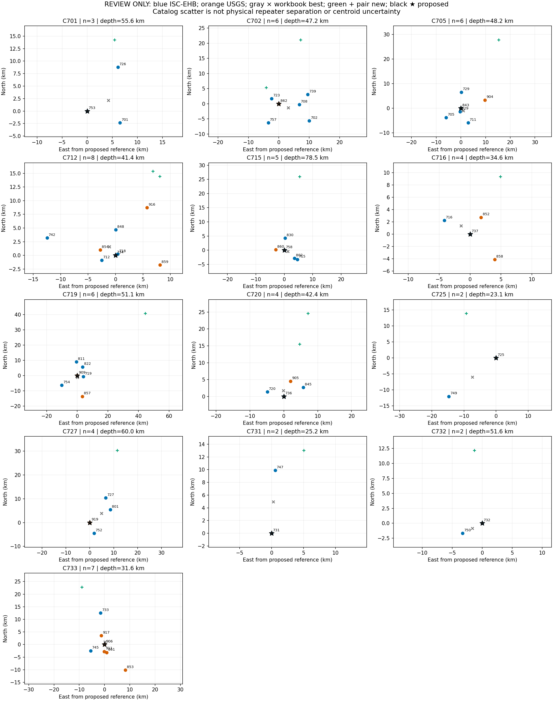
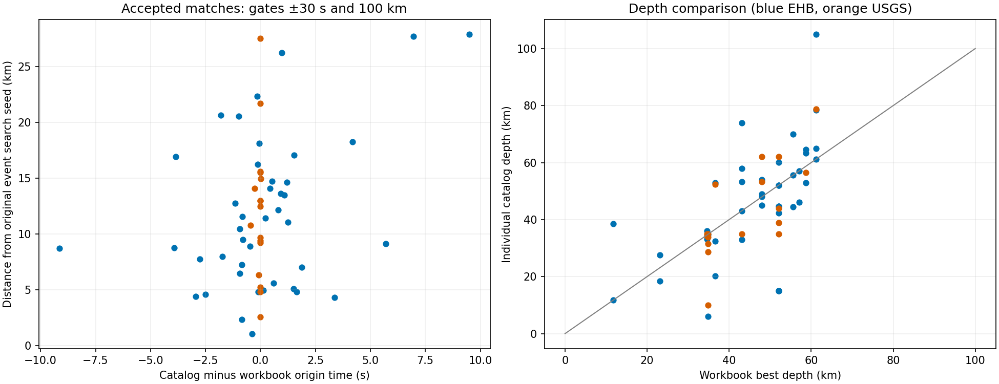
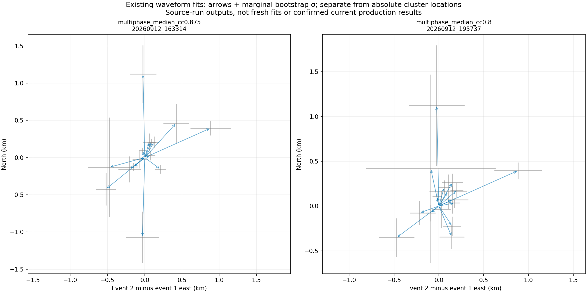
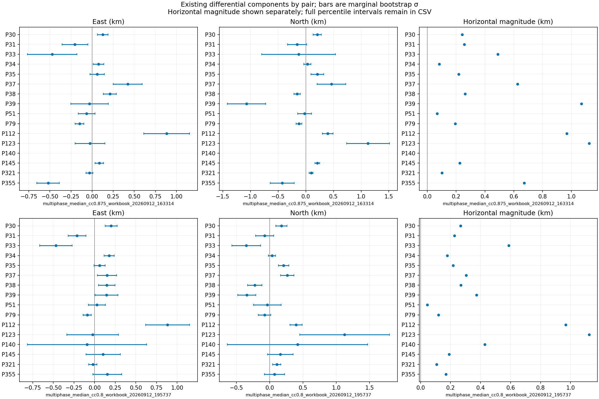

# Catalog location review

Run `47c2641716993cc6`. Review only; no locations adopted.

59 events; 13 connected components. Match status: {'matched': 42, 'fallback': 17}.

## Proposed exact rule

All valid pair-table edges are connected before retaining components touching active pairs. Each event contributes once. Match against ISC-EHB first, then USGS ComCat, within 30 seconds and 100 km of the original event LAT/LON/DEP (NEIC columns only if missing). Multiple candidates in the first nonempty catalog block selection; catalog-ID collisions block every affected event. No workbook best-location or station-acceptance fallback is allowed. Missing members block a complete cluster reference.

For each complete cluster, choose the member epicentre with minimum summed great-circle distance (6371.0088 km spherical radius; smallest workbook event ID resolves exact ties). Use the median of all member catalog depths. Fallback members receive equal weight. The EHB-only sensitivity below exposes that choice. This is a reference convention, not an uncertainty-weighted hypocentre inversion.

| Cluster | Members | Latitude | Longitude | Depth km | Median/max horizontal scatter km | Fallback count | Fallback influence horizontal/depth km |
|---|---|---:|---:|---:|---:|---:|---:|
| C701 | 701, 726, 753 | -56.3040 | -26.9350 | 55.60 | 6.94/10.70 | 0 | 0.00/0.00 |
| C702 | 702, 708, 723, 739, 757, 862 | -56.2146 | -27.0330 | 47.20 | 6.95/11.47 | 1 | 6.74/4.90 |
| C705 | 705, 711, 729, 829, 843, 904 | -58.0020 | -25.6030 | 48.20 | 6.58/10.34 | 1 | 1.37/-5.10 |
| C712 | 712, 718, 734, 742, 848, 854, 859, 916 | -59.0900 | -25.7370 | 41.39 | 3.81/12.87 | 3 | 0.00/-3.31 |
| C715 | 715, 758, 802, 830, 860 | -56.3430 | -26.8030 | 78.50 | 4.24/5.70 | 1 | 4.60/6.80 |
| C716 | 716, 737, 852, 858 | -58.7310 | -25.2790 | 34.60 | 3.99/5.74 | 2 | 4.71/0.00 |
| C719 | 719, 754, 811, 822, 857, 909 | -57.5055 | -25.9301 | 51.14 | 7.89/14.06 | 2 | 6.70/2.64 |
| C720 | 720, 736, 845, 905 | -59.0230 | -25.6890 | 42.41 | 5.00/6.32 | 1 | 0.00/10.01 |
| C725 | 725, 749 | -55.3250 | -28.1340 | 23.05 | 9.50/19.00 | 0 | 0.00/0.00 |
| C727 | 727, 752, 801, 919 | -56.0256 | -27.2919 | 59.97 | 7.49/12.35 | 1 | 10.14/-3.43 |
| C731 | 731, 747 | -59.6810 | -26.2680 | 25.20 | 4.96/9.91 | 0 | 0.00/0.00 |
| C732 | 732, 750 | -59.6470 | -26.3960 | 51.60 | 1.83/3.66 | 0 | 0.00/0.00 |
| C733 | 733, 745, 853, 861, 906, 911, 917 | -58.7558 | -25.2864 | 31.59 | 3.78/13.07 | 5 | 12.64/11.14 |

## QC and interpretation

Member scatter is not a confidence interval and does not establish physical source separation. The medoid can coincide with a fallback event; compare the EHB-only sensitivity before approval. Two-member medoids tie, so the smaller event ID determines the epicentre. No precision gain from shared biases is assumed. Depth classes are conservatively derived from ISC flags; unknown classes remain Not recovered. USGS depths do not acquire an EHB class.

The saved waveform vectors retain their source run, east/north components, scalar separation, and existing marginal bootstrap uncertainties. Catalog-minus-waveform vector differences and scalar differences are separate fields. No new differential fit or uncertainty calculation was performed. Neither those vectors nor station acceptance enter the absolute reference calculation.

Review the membership, fallback influence, depth rule, and large-scatter clusters before requesting any production migration. No writer or active-configuration switch is included.

Sources: [ISC-EHB](https://www.isc.ac.uk/isc-ehb/), [official HDF format](https://download.isc.ac.uk/isc-ehb/format2.hdf), [USGS query documentation](https://earthquake.usgs.gov/fdsnws/event/1/). Exact requests and retrieval times are in inputs/source_manifest.json.
